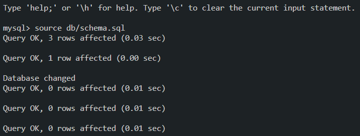

# Employee Tracker

The task is to build a command-line application from scratch to manage a company's employee database, using Node.js, Inquirer, and MySQL. Using the application, I can view and manage the departments, roles, and employees in a company so that I can organize and plan my business.

## Function of the application

- When I choose to view all departments, then I am presented with a formatted table showing department names and department ids.
- When I choose to view all roles, then I am presented with the job title, role id, the department that role belongs to, and the salary for that role.
- When I choose to view all employees, then I am presented with a formatted table showing employee data, including employee ids, first names, last names, job titles, departments, salaries, and managers that the employees report to.
- When I choose to add a department, then I am prompted to enter the name of the department and that department is added to the database.
- When I choose to add a role, then I am prompted to enter the name, salary, and department for the role and that role is added to the database.
- When I choose to add an employee, then I am prompted to enter the employee’s first name, last name, role, and manager, and that employee is added to the database.
- When I choose to update an employee role, then I am prompted to select an employee to update and their new role and this information is updated in the database.

## Initialize the database

When you launch the application the first time, you need to initialize the database.

On the terminal, enter the following commands:

1. Enter "mysql -u root -p" and then the password of mysql.

2. Enter "source db/schema.sql" in the mysql shell to create a database.

3. Enter "source db/seed.sql" to pour data into the database.

4. Enter "quit" to go back to the main terminal.

Note that you only need to do that the first time of using the application.

## Start the application

Type "node index.js" in the terminal to start the application, you will be presented with the following menu:

The function of each option will be introduced in the walkthrough video.

## Walkthrough video

[Link to the walkthrough video](https://drive.google.com/file/d/1QunKPEIgGmoXljrw4vrwh7wWC9Vr1TgH/view)

## Link to the github

[Link to the github](https://github.com/cckinwest/employee-tracker/)
